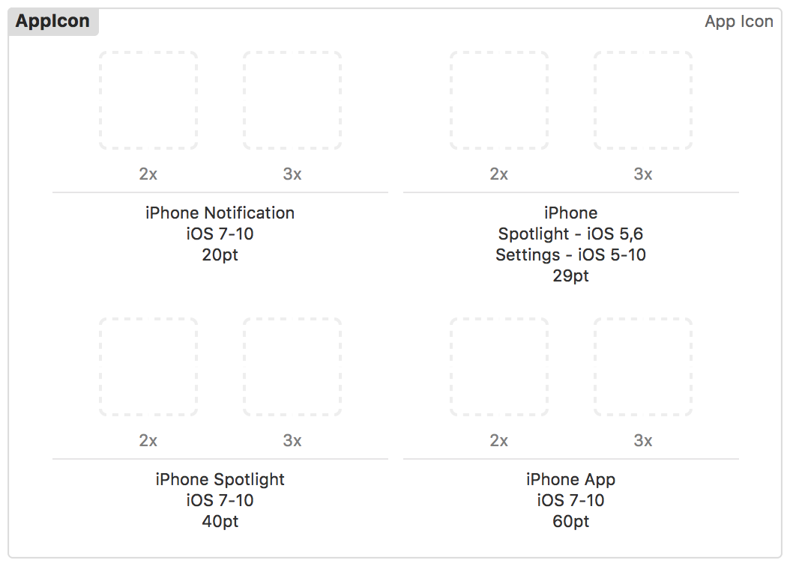

## Introduction




Transform PNG files into the requisite sizes for Apple platforms. Doesn't require ImageMagick which can be a pain to get working on a Mac. Instead, it uses the `sharp` module.

## Arguments

`--input input file`   

`--output output directory`   

`--spec list of images sizes to generate, see example below`

## Example usage

```
npm install -g apple-icon-gen

apple-icon-gen --input='data/input/icon.png' --output='data/output' --spec='20@2 20@3 29@2 29@3 40@2 40@3 60
@2 60@3'
```

## Troubleshooting

The code is really simple. Modify/debug it if there are exceptions.

